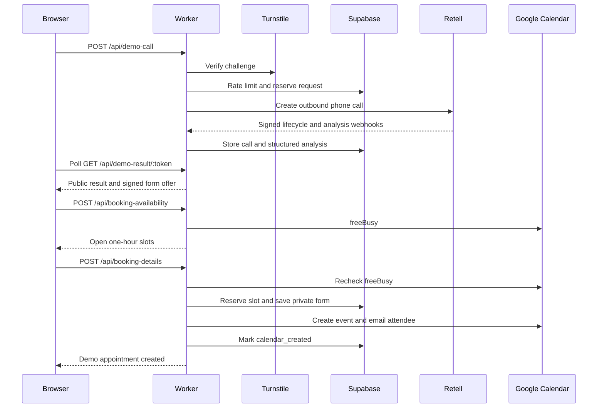

# HVAC voice AI demo: project blueprint

This document describes the repository and the live configuration as of September 29, 2026. The business, Austin Comfort HVAC, is fictional. A calendar event is a **demo appointment**, not an actual HVAC dispatch.

## 1. What the visitor experiences

1. A visitor enters a US or `+91` Indian number, agrees to an AI call and recording, and completes Cloudflare Turnstile.
2. The site asks a private Cloudflare Worker to place one outbound Retell call.
3. Sarah, the Retell voice agent, discloses that she is AI, asks about the HVAC problem, urgency, location, and preferred service time, and makes no booking promise during the call.
4. Retell sends call lifecycle and post-call analysis events to the Worker. The site polls for a sanitized result and displays a transcript, summary, and structured lead fields.
5. For an eligible, non-emergency call, the site opens a private details form. The caller supplies email and service address and chooses a date and available time.
6. The Worker checks the dedicated Google Calendar, reserves the slot in Supabase, creates a private one-hour Google event with the visitor as an attendee, and returns success. Google sends the invitation.

## 2. Repository map

| Path | Responsibility |
| --- | --- |
| `apps/web` | React, TypeScript, Vite site. Consent form, call status, transcript, post-call form. |
| `apps/worker` | Cloudflare Worker API. Validates requests, talks to Retell, Supabase, Turnstile, and Google Calendar. |
| `packages/shared` | Request and response types shared by browser and Worker. |
| `supabase/migrations` | Private database tables, constraints, stored procedures, and permissions. |
| `retell/AGENT_PROMPT.md` | Source for Sarah's conversational instructions. Publish changes separately in Retell. |
| `retell/CONVERSATION_EVALS.md` | Manual voice conversation checks. |
| `.github/workflows` | GitHub Actions validation and GitHub Pages deployment. |
| `docs` | Setup and operating guides. |

The website is static; it holds no Retell, Supabase, Turnstile private, or Google OAuth keys. The Worker owns those integrations. `VITE_DEMO_API_URL` and `VITE_TURNSTILE_SITE_KEY` are intentionally public browser settings. Worker secrets are not `VITE_*` variables.

## 3. Call initiation and protection

`DemoCallForm.tsx` collects a phone number and two explicit consents. `POST /api/demo-call` checks JSON, phone normalization, consents, the allowed browser origin, and the Turnstile token. The production Worker uses the Turnstile hostname for the GitHub Pages site. A salted hash of the phone and IP supports abuse limits; the raw phone stays private. The Supabase `reserve_demo_request` procedure enforces cooldown, per-IP, and global limits atomically, then the Worker asks Retell to call. The Worker passes a maximum duration of 300 seconds.

The live configuration currently allows 25 accepted calls per UTC day, 10 per IP hash per rolling 24 hours, and a one-minute phone cooldown. Those are configuration values, not constants of the design. The public response contains an opaque UUID token, not the database row ID or phone number. Browser state retains that token so a reload can resume the call result.

## 4. Voice agent and result processing

Retell makes the phone call from the configured Retell number using the published agent version. The agent receives fictional company context and Austin time context. Its prompt requires AI and recording disclosure, short questions, emergency caution, and no claim that a real appointment is booked on the call. Service hours are **8 AM to 9 PM America/Chicago**. One-hour appointments may start from 8 AM through 8 PM. For phrases such as “Friday, two o'clock,” the revised prompt infers **2 PM** because 2 AM is outside service hours; 8 o'clock remains ambiguous and can be clarified.

Retell post-call analysis supplies issue category, urgency, lead qualification, appointment interest, human request, service location, preferred timing/date/time, confidence, booking eligibility, and summary. The Worker checks the signed webhook against the raw payload, correlates it to the original request, rejects replayed events, validates structured fields, and stores lifecycle/transcript/analysis in Supabase. `GET /api/demo-result/:publicToken` returns only the public subset. It excludes phone number, private address, email, provider call ID, recording URLs, and internal database ID. The site polls until the call is complete and analysis is ready.

The transcript can reflect interrupted speech as separate lines. The structured analysis is a model output and should be treated as a suggestion; server-side validation and the visitor's final form choice determine the calendar booking.

## 5. Post-call form and scheduling

The form is offered after a completed, non-emergency call with analysis. The Worker issues an HMAC-signed token bound to the call, expiring one hour after completion. The form can suggest a date and time when Retell's interpretation has high confidence and falls in the next 30 Austin-local days. A suggestion is not a reservation. The visitor confirms email, address, date, and time.

`POST /api/booking-availability` validates the signed token and date, queries Google Calendar `freeBusy`, and removes overlapping slots. Slots are every 30 minutes from 08:00 through 20:00 Austin time; each event lasts one hour, ending no later than 21:00. `booking-schedule.ts` converts Austin local times to UTC with daylight saving time handling. The Worker repeats the free/busy check on submission because availability can change after the dropdown loads.

`POST /api/booking-details` validates the private form, reserves the selected slot in Supabase, and creates an event in a separate demo Google Calendar. A database uniqueness rule blocks two active submissions for the same slot. The Google event ID is deterministic from the private request ID, so retrying an already-created event can recognize Google's duplicate response. Google receives the attendee email and sends event updates. The site now reads a `calendar_created` booking status from the public result on reload, so a completed booking displays a success card instead of reopening a form.

The current implementation uses one dedicated demo calendar and one appointment per slot. It is not a multi-technician dispatch scheduler, and it does not schedule real HVAC service.

## 6. Database and security model

`demo_requests` holds the consented request, public token, private phone, salted phone/IP hashes, status, and Retell correlation. `calls` holds lifecycle times, transcript, structured analysis, and private recording references. `retell_webhook_events` provides webhook idempotency. `booking_detail_submissions` holds private email/address, selected local date and time, token expiration, booking status, Google event ID, and failure code. Migrations add stored procedures for atomic request reservation, Retell event application, booking submission, completion, and failure.

Row Level Security is enabled. Browser roles have no policy to read private tables. The Worker uses the Supabase server secret, and the browser sees only the Worker API. CORS restricts the public site origin. The form token is signed and short-lived. Production request logs are structured and avoid customer contact fields. Do not expose Worker secrets, OAuth refresh tokens, or Supabase secret keys in the repository, browser bundle, or chat.

## 7. The September 29 booking incident

The call in the screenshots requested Friday, October 2, 2026 at 2 PM Austin time. Sarah needlessly asked “2 AM or 2 PM”; the Retell timing prompt has been changed and published as version 15 to infer 2 PM. This should be checked with another call or Retell text test because prompt compliance is probabilistic.

The Worker did create the Google Calendar event, but a PostgreSQL regular expression in `complete_calendar_booking` and a table constraint used `{5,1024}`, an unsupported repetition bound. The database rejected the completion step, so the site saw HTTP 503. A later attempt saw the already-created event as busy and showed “That time was just taken.” Migration `20260929000100_fix_calendar_event_id_validation.sql` replaces the giant regex repetition count with a separate length check and a simple character-class regex. The production database was patched and the existing request reconciled. A read-only production check now shows `calendar_created` and a stored event ID. This is a **demo calendar appointment**; it is not real HVAC service.

The fix also adds a public, non-PII confirmation status to the result endpoint and the site. Reloading the same call URL can show that this particular booking succeeded after the new Worker and site versions deploy.

## 8. Reproduce the system

1. Clone the repository, install Node.js and dependencies with `npm ci`, and run `npm test`, `npm run lint`, and `npm run build`.
2. For local UI and API work, use `npm run dev` and `npm run dev:worker`. The default Worker uses an in-memory repository, mock Retell client, and local Turnstile verifier. Read `docs/LOCAL_SETUP.md` for the local environment.
3. Create a Supabase project and apply every SQL file in `supabase/migrations` in timestamp order, including the September 29 validation fix. Give only the Worker the Supabase secret key. Read `docs/SUPABASE_SETUP.md`.
4. Create a Retell voice agent, add the prompt and structured post-call fields from `retell/SETUP.md`, configure an outbound number and the signed `/webhooks/retell` endpoint, and publish the agent. Prompt edits in Git alone do not update the live agent.
5. Create Cloudflare Turnstile for your eventual website hostname. Put its site key in the website build settings and its secret key in the Worker. Configure the allowed origin, expected hostname, hash salt, and call limits. Read `docs/ABUSE_PROTECTION_SETUP.md`.
6. Create a separate Google Calendar. Enable Calendar API in a Google Cloud project, create OAuth credentials and a refresh token with event and free/busy scopes, and configure the private Worker secrets and calendar ID. Read `docs/GOOGLE_CALENDAR_BOOKING_SETUP.md`. Keep booking disabled until this works end to end.
7. Deploy the Cloudflare Worker using `apps/worker/wrangler.production.jsonc` and private Wrangler secrets. Deploy the Vite site with the GitHub Pages Actions workflow, setting `VITE_DEMO_API_URL` and `VITE_TURNSTILE_SITE_KEY` as GitHub Actions variables. The Worker and website deploy independently. Read `docs/DEPLOYMENT.md`.
8. Test consent rejection, Turnstile failure, rate limits, Retell webhooks, emergency and ambiguous times, a successful booking, a busy calendar slot, and a page reload after booking. Check both the Google event and the Supabase booking state for a successful end-to-end booking.

For another business, replace the fictional company prompt, voice, service hours, timezone, service questions, structured analysis, scheduling rules, calendar, phone number, branding, and disclosures. Keep the secret boundary and server-side scheduling checks.

## 9. Operational limits

Retell calling, Google OAuth credentials, calendar permissions, Supabase, and Cloudflare availability are external dependencies. The OAuth refresh token needs monitoring, especially if the Google consent app remains in Testing mode. A signed form link expires one hour after the call and booking dates are limited to 30 days. Google may create an event before the Worker receives or stores the confirmation; the deterministic event ID and database state must be checked before retrying in that situation. The revised success display reports stored `calendar_created`, but it does not prove invitation delivery into the recipient's inbox.
